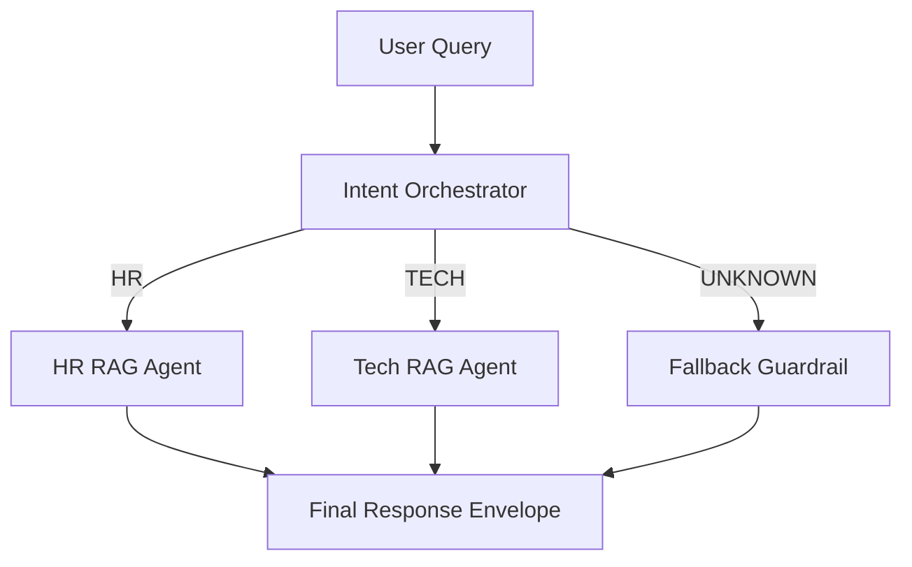

# 05_project - Multi-Agent Router + Domain RAG (LangChain)

Proyecto base para un sistema multi-agente en el que:

1. Un **Agente Orquestador** clasifica la intencion de la consulta del usuario.
2. El flujo aplica **ruta condicional** por dominio:
   - `HR` (Recursos Humanos)
   - `TECH` (Tecnologia)
3. Se delega la respuesta al **Agente RAG especializado** correspondiente.
4. Se devuelve una respuesta contextualizada, con fuentes y trazabilidad de ruta.

## Arquitectura



## Que incluye este esqueleto

- Prompt creativo para clasificacion de intencion.
- Prompt creativo para agente RAG de RRHH.
- Prompt creativo para agente RAG de Tecnologia.
- Retriever hibrido por keywords con scoring (placeholder para reemplazar por vector DB).
- Enrutamiento condicional dinamico con `RunnableBranch` (LangChain).
- Estructuras Pydantic para outputs tipados.
- Memoria de conversacion por `conversation_id` (in-memory).
- Umbral configurable de confianza para forzar fallback seguro.
- CLI simple para ejecutar una consulta.
- Tests de routing sin depender de LLM externo.

## Estructura

```text
05_project/
  data/
    hr/manual_rrhh.md
    tech/runbook_tech.md
  src/multi_agent_system/
    __init__.py
    config.py
    schemas.py
    prompts.py
    intent_classifier.py
    retrievers.py
    rag_agents.py
    orchestrator.py
    pipeline.py
    main.py
  tests/test_routing.py
  .env.example
  pyproject.toml
```

## Setup

```bash
cd 05_project
uv sync
cp .env.example .env
```

Configura `.env`:

```bash
OPENAI_API_KEY=sk-...
OPENAI_MODEL=gpt-4o-mini
INTENT_MIN_CONFIDENCE=0.60
MAX_HISTORY_TURNS=4
```

## Ejecutar

```bash
uv run python -m multi_agent_system.main --query "Necesito actualizar la politica de vacaciones"
uv run python -m multi_agent_system.main --query "Como rotar secretos en Kubernetes sin downtime"
uv run python -m multi_agent_system.main --query "Tengo dudas de onboarding y CI/CD" --hide-debug
uv run python -m multi_agent_system.main --query "vacaciones" --use-heuristic-router
```

## TODO para produccion

- Reemplazar `SimpleKeywordRetriever` por vector store semantico (FAISS, PGVector, etc.).
- Incorporar evaluacion automatizada (quality gates).
- Telemetria: latencia por rama, costo por token, precision de routing.
- Guardrails de compliance por dominio (legal/seguridad).
